# Fairness / Bias Report

## 1: Definition of Groups

- **Sex:** Evaluates whether predictive accuracy differs systematically
between male and female populations.
- **Race/Ethnicity:** Assesses potential disparities in model performance
across racial or ethnic groups, given known structural inequalities in
health systems.
- **Age:** Examines performance variation across age strata. While
epidemiological differences are expected, disproportionate predictive
error may indicate model sensitivity to demographic composition.
- **Region:** Evaluates territorial disparities in predictive performance.
Regional heterogeneity in infrastructure and reporting practices may
affect model reliability.
- **Hospital Size**: Examines model's predictive capabilities based on
hospital's size.

## 2: Metric Selection

Fairness comparisons were conducted using the
Symmetric Mean Absolute Percentage Error (SMAPE). Percentage-based
metrics were preferred because they allow relative comparison across
groups with different baseline incidence levels.

Absolute error measures such as MAE or RMSE are scale-dependent
and may not be directly comparable when hospitalization volumes
differ substantially between groups. SMAPE provides a normalized measure
of predictive deviation, facilitating cross-group disparity assessment.

**Base results:**

- Age:
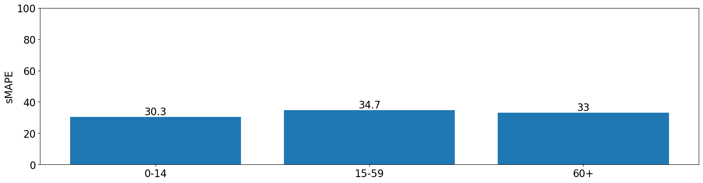

- Sex:
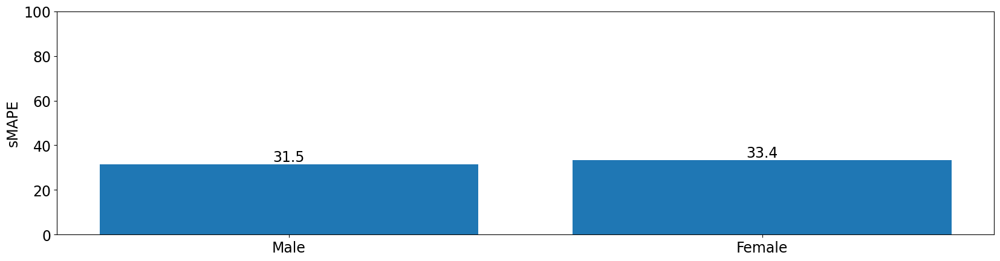

- Race:
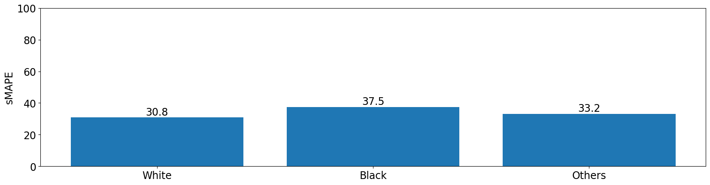

- Region:
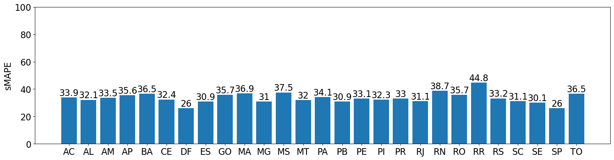

- Size:
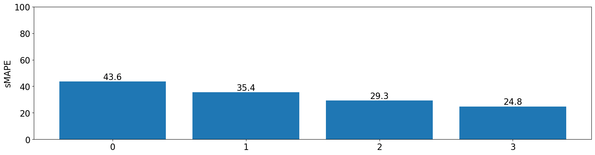

## 3: First Evaluation

Analyses from the results reveal a low disparity in model performance
when looking at different groups based on age, sex and race.
On the other hand, efficiency is widely different when looking
through different regions and hospital sizes, both portraying a difference
of 18.8% when comparing best and worst cases.

An attempt was done at bias correction through resampling (more on the next
section), though only region based resampling led to a positive outcome. Every
attempt at resampling data based on hospital size would at least triple error
metrics and drastically increase disparity across all groups. For this reason,
only region received bias mitigation treatment.

## 4: Bias mitigation

To address the identified regional disparity, we implemented a mitigation
strategy based on data resampling. While tools like Fairlearn offer
algorithmic constraints, resampling was selected as an initial intervention
due to its transparency and minimal architectural modification requirements.

We employed SMOTE-NC, an adaptation of the Synthetic Minority Over-sampling
Technique for mixed-data types, to over-sample underrepresented regions.
Over-sampling was preferred to preserve the overall training data volume.
Resampling was applied exclusively to the training partition after the split.
Synthetic samples were generated within the training data only,
preserving the prospective evaluation design and preventing temporal leakage.
A fixed randomized seed was used, with value 18979.

- **Base sample:**

**Age:**

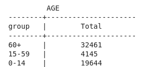

**Sex:**

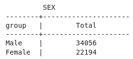

**Race**:

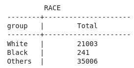

**Region**:

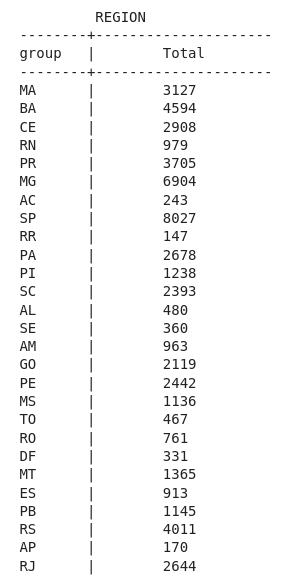

**Hospital Size**:

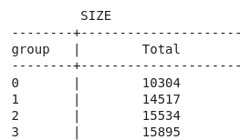

- **After Resampling:**

**Age:**

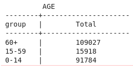

**Sex:**

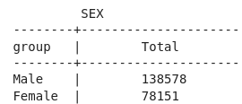

**Race**:

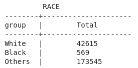

**Region**:

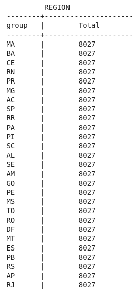

**Hospital Size**:

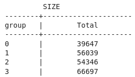

## 5: Second Evaluation

The resampling strategy reduced the max–min regional SMAPE gap
from 18.8 to 18.3 percentage points, corresponding to a 2.6%
relative reduction. While this indicates small sensitivity to
training distribution imbalance, a substantial residual disparity persists.
This suggests that regional predictive gaps are not solely attributable
to sample imbalance and may reflect structural or data quality asymmetries
within the health system. Across other groups, no disparities were created
during resampling.

**Results:**

- Age:

- Sex:

- Race:

- Region:
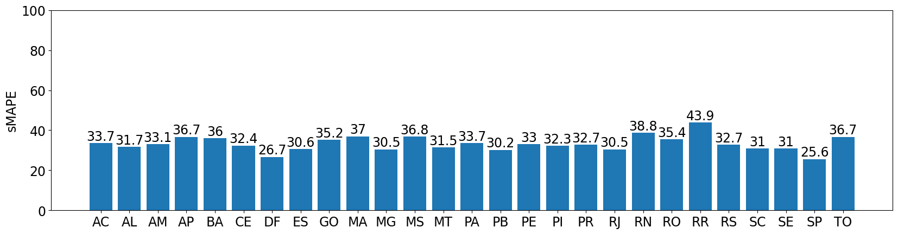

- Size:
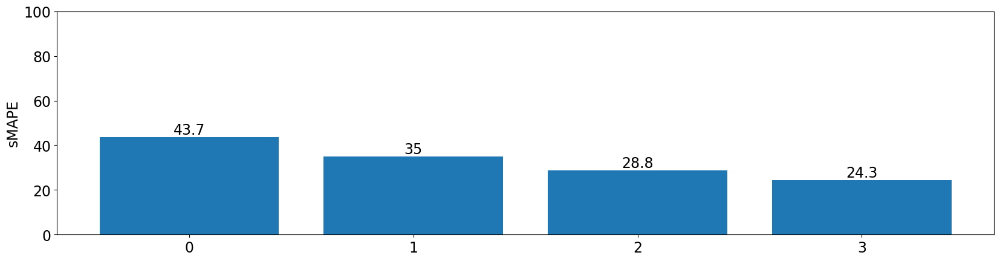

**Obs:** Many attempts were done at resampling, including test with
over-sampling or under-sampling of multiple groups other
then region. Many test were also conducted with different seeds.
The current finalized version contains the best case scenario found.
All other test resulted in worse performance with no gain in bias reduction.
