# Relatório de Justiça / Viés

## 1: Identificação de Grupos Sensíveis

- **Sexo:** Uma menor acurácia quanto a algum sexo pode levar à
injustiças contra esse grupo, que sairia mais prejudicado pelas
decisões tomadas baseada no modelo.
- **Raça:** Assim como sexo, qualquer viés presente resultará em
disparidade entre tratamentos e disposição de recursos para alguns
grupos com maior taxa de erro no modelo.
- **Idade:** Por mais que seja esperado resultados diferentes para cada
faixa etária, um viés presente dentro de uma faixa pode implicar em
um foco maior sendo dado a um grupo e ignorando os outros.
- **Região:** Naturalmente, há disparidade entre regiões, seja devido ao
recursos disponíveis ou condições externas que levam a mais casos de
doenças respiratórias. Por isso, mostra-se importante verificar o
desempenho do modelo, não importando a região.

## 2: Cálculo de Métricas

  Para análise de justiça, foi usado apenas a métrica de sMAPE,
uma vez que outras métricas disponíveis (como MAE e RMSE) trabalham com
valores absolutos, e trazem informações inconclusivas quando há diferença
na quantidade de dados por categoria.

  Além disso, para verificar impacto sobre grupos, categorizou-se cada dado
baseado na média histórica dos grupos sociais. Em outras palavras, como os
dados estão agregados e possui múltiplos valores (devido aos "lags"),
era necessário uma estratégia para categorizar qual grupo os dados melhor
representavam. Para tal, tira-se a média de todos os valores "lag" que representavam
um grupo específico, e no final verifica-se qual grupo é maioria.
Por exemplo, um hospital que, no agregado, possui mais mulher a homem é categorizado
como dentro do grupo sensível feminino ("Fem").

  Segue-se os resultados:

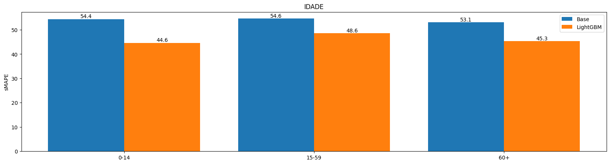
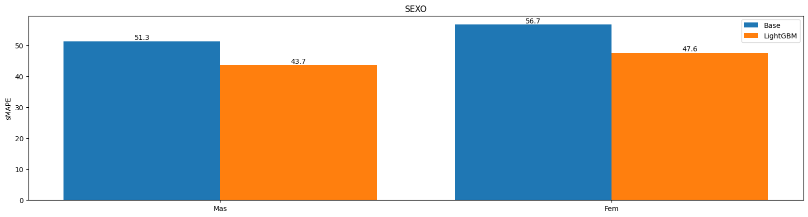
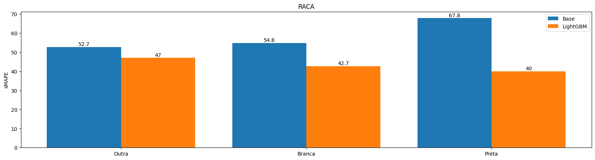
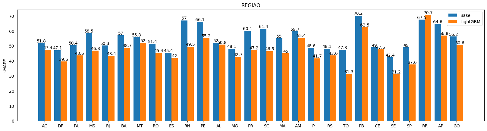

## 3: Avaliação Inicial

  Notou-se pequena disparidade entre os grupos dentro das
categorias de idade, sexo e raça. A maior diferença presente é
entre pessoas pretas e pessoas de outras raças (7%).

  No entanto, uma disparidade maior foi encontrada entre as regiões.
Por mais que a maioria esteja na casa dos 40% e 50%, temos regiões com
valores bons (SE, 31.2%) e valores péssimos (RR, 70.7%).

  Para garantir maior justiça no modelo, definiu-se regiões como prioridade
de correção. Quanto aos outros grupos, o objetivo é não afetá-los durante
o processo de mitigação dos erros.

## 4: Correção

  A metodologia usada para esse processo é a reamostragem,
o qual consiste na equalização da quantidade de dados entre diferentes grupos.
Em especial, decidiu-se criar dados sintéticos para "over-sampling", uma vez que
a remoção de dados ("under-sampling") resultaria em poucos dados no total para
treinamento do modelo.

  Para reamostragem, foi utilizada a ferramenta SMOTENC, varição de SMOTE capaz
de trabalhar com dados categóricos. A fim de garantir replicabilidade, foi definido
uma semente aleatória fixada, com valor 17.

- **Amostragem inicial:**

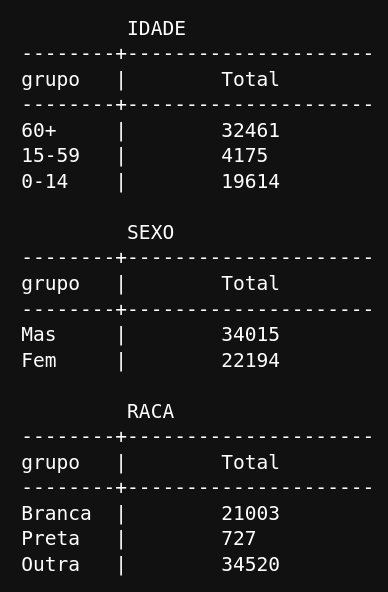
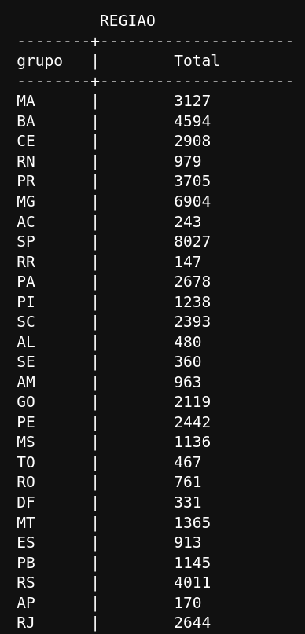

- **Amostragem pós processamento:**

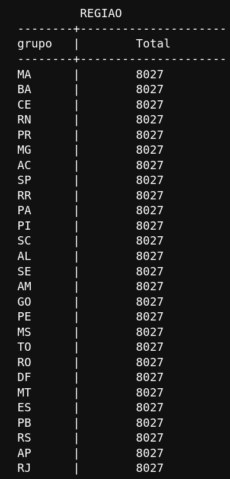

## 5: Reavaliação

  Notou-se uma pequena diminuição da disparidade encontrada anterior,
reduzindo de 39% para 34%. Em especial, houve uma melhora na performance
geral do modelo em relação às regiões. A maioria agora se concentra especificamente
na casa dos 40%, com poucos sobressaindo esse valor. O pior caso desceu de 70% para
62% e o melhor caso caiu de 31% para 28%.

  Quanto às outras categorias, cumpriu-se o objetivo de mantê-las similares, evitando
assim de criar uma nova diferença de desempenho entre os outros grupos.

- **Resultados:**

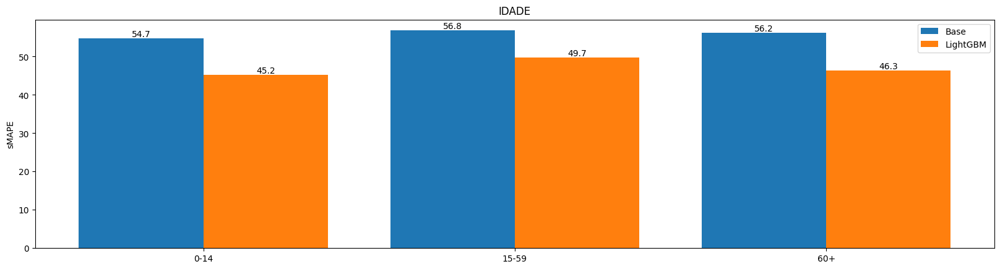
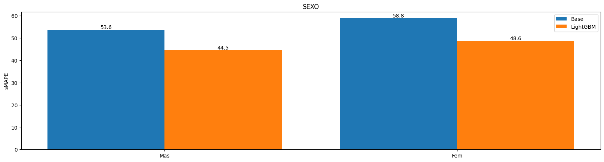
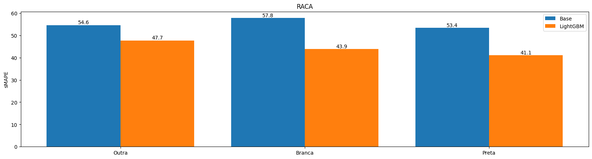
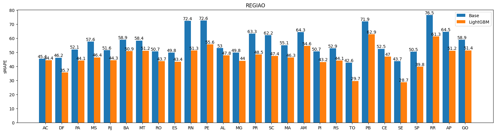

**Obs:** Foi feito vários testes de reamostragem, incluindo testes contendo
"over-sampling", "under-sampling" e reamostragem de outros grupos além da
categoria de região. Os resultados tendiam a piorar as outras categorias
sem haver melhora na categoria de região.
