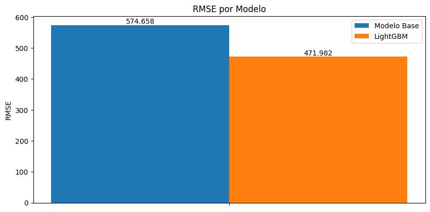
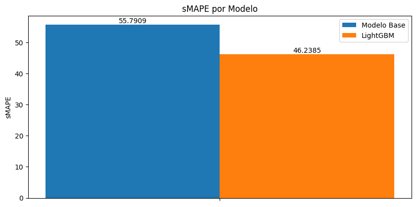
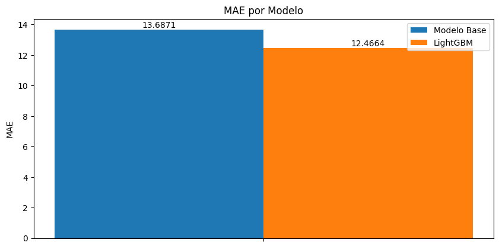
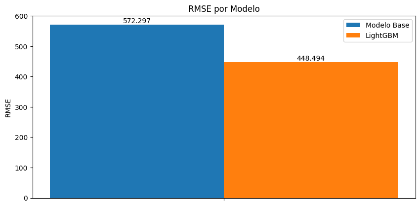

# Relatório de Desempenho (métricas)

## 1: Métricas escolhidas

- MAE (mean absolute error): Métrica básica de fácil compreensão.
Sua função é calcular o erro total apresentado pelos modelos, penalizando
igualmente erros acima e abaixo do valor esperado. Não há penalização
extra para valores altos. Valores altos indicam alta quantidade de erros
ou erros graves.

- RMSE (root mean square error): Métrica intermediária para análise
de erros graves nos modelos. Por ser exponencial, erros altos são
severamente penalizados no cálculo. Ideal para avaliar consistência
das respostas. Valores altos indicam alta quantidade de erros graves.

- SMAPE (symetric mean absolute percentage error): Métrica intermediária
para análise de erros absolutos nos modelos em formato percentil. Sua
resposta pode ser interpretada como: "o modelo erra em até X %", sendo
X o valor retornado por essa métrica. Valores altos indicam alta taxa de erro.

## 2: Resultados obtidos

  Para cada métrica, será apresentado os resultados junto de uma análise conjunta.

**Obs:** O modelo base é uma Regressão Linear, implementada pela biblioteca sklearn.
Além disso, os resultados foram retirados do modelo final, pós avaliação e
implementação de algoritmos para justiça e mitigação de viés

- MAE:

  Pelo resultado, percebe-se que o modelo LightGBM possui uma menor
quantidade de erros quando comparado com o modelo base. Além disso a
média de erro esta na casa dos 12 a 13 unidades (internações). Ou seja,
no geral, os modelos erram 12 a 13 internações por dado.

- RMSE:

  Novamente o modelo LightGBM teve um desempenho melhor que o modelo
base, dessa vez com uma grande diferença. No entanto, para ambos, nota-se
um valor muito alto quando comparado com MAE (os quadrados de 12 e 13 são
144 e 169, porém os resultados chegaram à 471 e 574). Tais valores indicam
erros muito grandes para alguns casos, enquanto os valor baixo da MAE
indica a presença de erros pequenos que "compensam" os valores mais altos.

- sMAPE:

  Finalmente, a métrica sMAPE revela o tamanho dos erros dos modelos.
Percebe-se que o erro é grande, significando que o modelo pode errar em
até 55% e 46% da resposta esperada (modelo base e LightGBM, respectivamente)
Esse dado corrobora com a métrica RMSE, que revelou grande quantidade de
erros graves. Mais uma vez, o modelo LightGBM possui melhor desempenho comparado
ao modelo base.

## 3: Resultados pré Justiça

  A fim de comparação posterior, segue-se os resultados obtidos dos modelos
antes da execução dos algoritmos de justiça.

## 4: Conclusão

  Após a análise dos resultados obtidos, percebe-se que o modelo LightGBM
entregou respostas melhores, mais próximas da realidade, enquanto o modelo
base apresentou um comportamento menos assertivo.

  No entanto, ambos apresentaram um comportamento parecido: erros graves acompanhado
de alguns acertos. Os erros graves podem ser analisados pelas métricas sMAPE e RMSE,
que revelaram uma alta taxa de predições longe da realidade.
Os poucos acertos, nesse caso aparecem pela métrica MAE, que apresentou uma
média baixa de erros. Provavelmente, os erros leves reduziram o valor da média,
compensando os grandes erros apresentados.

  Devido à alta taxa de erros graves, nota-se então que os modelos não
apresentaram respostas consistentes, com baixa acurácia.
Em sua forma atual, eles não poderia ser usados de forma
profissional em hospitais, pois suas predições poderiam resultar em
decisões que não se aproximam da realidade, colocando a vida de
pacientes em risco.

  Por último, vale ressaltar que a implementação de algoritmos para mitigação de
viés podem e tendem a levar a resultados globais levemente piores.
