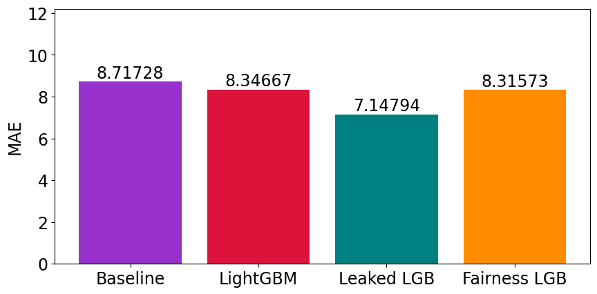
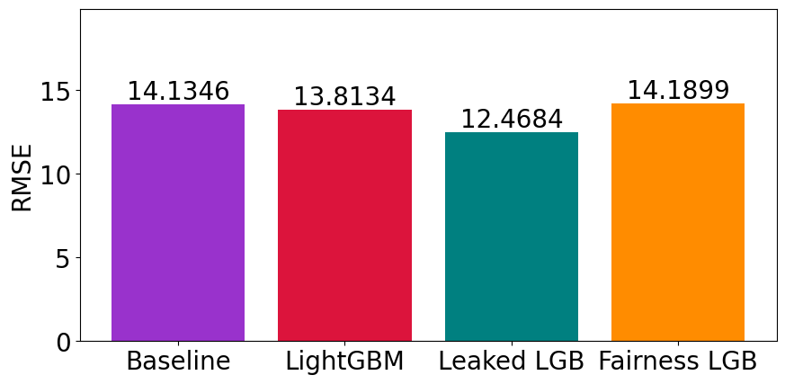
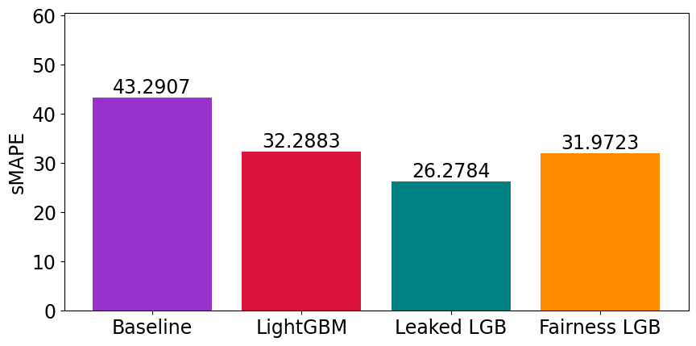

# Relatório de Desempenho (métricas)

## 1: Metrics used

- MAE (mean absolute error): Basic metric for simpler analysis.
It checks the average error the of each model's prediction, punishing
equally erros over and under the expected value. There is no extra
punishment for large errors. Higher values indicate a big quantity of
errors, or some large errors.

- RMSE (root mean squared error): Intermediate metric for catching
large errors. Since the formula uses exponencial, these errors are
heavily punished. Ideal for consistency evaluation. Higher values
indicate high amount of large errors.

- SMAPE (symetric mean absolute percentage error): Intermediate metric
for absolute error analysis with percentage based values. It may be
interpreted as "the model may miss, on average, by X %", X being the SMAPE value.
Higher values indicate higher miss rate.

## 2: Results
  
Each model used (Baseline, LightGBM, LightGBM with leakage, and LightGBM post
fairness algorithm) had it's predictions extracted and compared with the expected
(real) value. For each metric, a graph was created presenting all models performance,
followed by an analysis of the results and which conclusions can be made.

For more information on the models, please read *model_card.pdf*.

- MAE:

Overall, all LightGBM based models performed better than baseline.
The model with leakage performed best (as expected, since it contains
data helpful, but that shouldn't exist by the time it's trying to predict).
At last, there is a minimal diference between LightGBM and its fairness
counterpart.

As for the values itself, a 8 to 7 mean indicates than, on average,
the model misses by 8 to 7 hospitalizations.

- RMSE:

Again, LightGBM had a better performance than baseline, although this time
"Fairness" LightGBM was the worst performing one.

On the other hand, all models had a high RMSE (considering that MAE had 8 and 7).
Such disparity indicates a high amount of large errors, "compensated" by smaller
errors (hence why MAE is lower).

- sMAPE:

Lastly, SMAPE shows the magnitude of error for each model. Baseline is
the worst performing one by far, while LightGBM overall misses less.
However, all models have a tendency to commit large mistakes: models
are capable of missing by around 30% of the real value.

## 3: Conclusion

Comparing models, LightGBM made less errors than baseline, as shown by all
metrics. Between LightGBM models, leaked LightGBM was better in all metrics,
as expected, since it contains extra data that others don't have (and in a real
world scenario, it wouldn't exist), while LightGBM with Fairness was a mesh of
better and worse performance

However, all models behaved in a similar way: highly inconsistent predictions,
with many large errors and some small. This conclusion comes from a mixture of
analysis of each metric. Both SMAPE and RMSE reveal a tendency to make bad
predictions, with values far from the real values. On the other hand, MAE
shows that the average mistake is low, which means there are close predictions
to balance the further ones.
